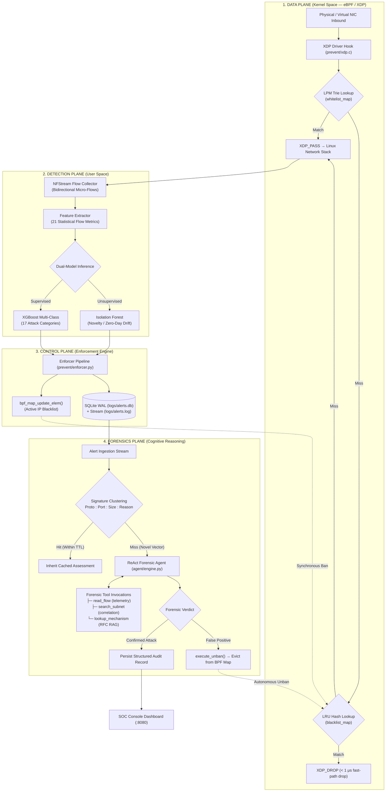

<a name="readme-top"></a>

<div align="center">

# ML-DDoS

**Autonomous DDoS detection, kernel-level mitigation, and LLM-assisted forensic verification.**

An end-to-end network intrusion defense architecture coupling in-driver eBPF/XDP packet filtering with dual-model traffic classification (XGBoost + Isolation Forest) and an asynchronous ReAct agent for forensic analysis, attack attribution, and automated false-positive remediation.

<br />

[](https://kernel.org)
[](prevent/xdp.c)
[](models/)
[](agent/)
[](LICENSE)

<br />

[Overview](#overview) &nbsp;•&nbsp;
[Architecture](#architecture) &nbsp;•&nbsp;
[Pipeline Mechanics](#pipeline-mechanics) &nbsp;•&nbsp;
[Threat Model](#threat-model--attack-coverage) &nbsp;•&nbsp;
[Repository Layout](#repository-layout) &nbsp;•&nbsp;
[Quick Start](#quick-start) &nbsp;•&nbsp;
[License](#license)

</div>

---

```text
┌── ML-DDoS ─────────────────────────────────────────────────────────────────────────────┐
│  Autonomous In-Kernel Defense & Cognitive LLM Forensics Engine                         │
├────────────────────────────────────────────────────────────────────────────────────────┤
│  Data Plane       : eBPF/XDP Hook               │ In-driver early drop (< 1 μs)        │
│  Flow Telemetry   : NFStream Bidirectional      │ 21 statistical flow metrics          │
│  Inference Engine : Dual ML (Supervised + Novel)│ XGBoost (17 classes) + IsoForest     │
│  Control Plane    : BPF Map Lifecycle Manager   │ Synchronous ban (5m → 1h → 24h)      │
│  Forensics Plane  : ReAct Agent + RFC RAG       │ Signature clustering + auto-unban    │
└────────────────────────────────────────────────────────────────────────────────────────┘
```

---

## Overview

### The Problem

Volumetric denial-of-service (DDoS) attacks overwhelm conventional host-based firewall frameworks (`iptables`, `nftables`, raw sockets) through resource exhaustion at the operating system boundary. When incoming packet rates reach millions of packets per second (Mpps), the operating system suffers severe bottlenecks:

* **Softirq Contention:** High-rate packet arrivals trigger relentless software interrupts (`NET_RX_SOFTIRQ`), consuming entire CPU cores purely for interrupt handling.
* **Socket Buffer Allocation:** The kernel allocates a `sk_buff` metadata structure for every ingested packet before evaluating user-space or netfilter rules, rapidly exhausting slab memory caches.
* **Context Switching:** Passing high-volume traffic across the kernel-user boundary for statistical inspection saturates host memory buses and introduces latency spikes.

Under saturation, the host crashes or drops legitimate traffic before detection heuristics can even execute.

### Architectural Solution

**ML-DDoS** decouples packet mitigation from compute-intensive traffic classification and forensic reasoning across four specialized planes:

* **Data Plane (Kernel Space):** Ingress packets encounter an **eBPF/XDP** hook directly in the network driver before `sk_buff` allocation. Known hostile IP addresses are dropped via in-kernel hash map lookups in sub-microsecond latency.
* **Detection Plane (User Space):** Allowed packets pass to the network stack where **NFStream** constructs bidirectional statistical micro-flows. Evaluates 21 flow metrics through dual complementary models: **XGBoost** for supervised classification across 17 known DDoS vectors, and **Isolation Forest** for unsupervised anomaly detection.
* **Control Plane (System Space):** An **Enforcer** pipeline synchronizes detected threats into the kernel's BPF blacklist map with progressive penalty escalation (`5m` → `1h` → `24h`) and persists thread-safe records into an indexed **SQLite WAL** database.
* **Forensics Plane (Cognitive Space):** An autonomous **ReAct LLM Agent** consumes alert streams asynchronously. Leveraging dynamic signature clustering to prevent API exhaustion, the agent interrogates raw flow telemetry, runs subnet correlation scans, queries RFC specifications, and reverses false-positive blocks in real time.

---

## Architecture

The following diagram illustrates the closed-loop relationship between the low-latency fast path, user-space detection, dynamic kernel enforcement, and cognitive forensic remediation:



---

## Pipeline Mechanics

### 1. In-Kernel Packet Filtering (eBPF / XDP)

Mitigation is performed at the earliest possible interception point in the Linux kernel via [`prevent/xdp.c`](prevent/xdp.c):

* **Whitelist Evaluation:** Queries an in-kernel Longest Prefix Match (LPM) Trie (`whitelist_map`) to safeguard loopback, trusted gateways, DNS resolvers, and internal subnets.
* **Blacklist Lookup:** Evaluates an LRU Hash Table (`blacklist_map`). If the source IPv4 address matches an active entry, the program immediately returns `XDP_DROP`.
* **Zero Allocation Overhead:** In-driver execution ensures dropping occurs before packet memory allocation (`sk_buff`), allowing line-rate filtering without host CPU saturation.

### 2. Dual-Model Machine Learning Engine

Rather than relying on brittle static threshold rules, [`detect/gatekeeper.py`](detect/gatekeeper.py) evaluates flows using two complementary statistical learning models:

* **Supervised Classification (XGBoost):** Evaluates 21 flow metrics (packet size distributions, inter-arrival time variance, TCP flag ratios, bidirectional throughput) against 17 distinct DDoS attack vectors.
* **Unsupervised Anomaly Detection (Isolation Forest):** Identifies novel volumetric and structural distribution shifts without requiring a pre-existing label, isolating zero-day attack patterns.

```text
Flow Metrics (21) ──► ┌────────────────────────┐ ──► Known Vector Attribution (17 classes)
                      │  XGBoost Classifier     │
                      └────────────────────────┘
                  ──► ┌────────────────────────┐ ──► Outlier / Zero-Day Anomaly Detection
                      │  Isolation Forest       │
                      └────────────────────────┘
```

### 3. Signature Clustering & LLM Cost Reduction

High-rate DDoS floods can emit tens of thousands of alerts per second. Passing every alert to a large language model would exhaust token budgets, saturate API rate limits, and introduce severe cost overhead. 

ML-DDoS implements dynamic signature clustering to compress redundant alert volumes:

$$\text{Cluster Key} = \text{Protocol} \;:\; \text{Port} \;:\; \left\lfloor\frac{\text{PacketSize}}{50}\right\rfloor \;:\; \text{Reason}$$

* **Cluster Miss:** The first alert exhibiting an unseen signature triggers a full ReAct multi-step forensic investigation.
* **Cluster Hit:** Subsequent alerts matching an active cluster key inherit the cached verdict (TTL: 10 minutes), cutting external API calls by **> 80%** while preserving continuous kernel-level enforcement.

### 4. Autonomous Cognitive Forensics & Remediation

The ReAct forensic investigator ([`agent/engine.py`](agent/engine.py)) operates as an automated tier-2 security analyst:

* **Multi-Step Tool Orchestration:** Inspects historical packet timings ([`tools/read.py`](tools/read.py)), analyzes subnet attack clustering ([`tools/search.py`](tools/search.py)), and verifies protocol amplification mechanics against official RFC documentation ([`tools/rag.py`](tools/rag.py)).
* **Automated False-Positive Reversal:** If flow analysis indicates standard bidirectional TCP handshakes, legitimate service traffic, or benign monitoring behavior, the agent invokes [`execute_unban()`](tools/execute.py) to evict the source IP from the BPF blacklist map without operator intervention.

---

## Threat Model & Attack Coverage

The dual-ML classification engine is trained to identify and mitigate 17 distinct denial-of-service vectors:

| Attack Vector | Layer | Target Protocol / Port | Exploitation Mechanism | Primary Detection Feature |
| :--- | :---: | :---: | :--- | :--- |
| **SYN Flood** | L4 | TCP / Any | Incomplete three-way handshake; state exhaustion | High SYN ratio, 0 ACK packets |
| **UDP Flood** | L4 | UDP / Random | Saturated bandwidth via non-connection socket flood | High packet rate, short durations |
| **DNS Amplification** | L7 | UDP / 53 | EDNS0 queries with spoofed victim source IP | Extreme downstream byte asymmetry |
| **NTP Amplification** | L7 | UDP / 123 | `monlist` command reflection generating 500x payload | Uniform packet size, high byte-to-packet ratio |
| **SNMP Reflection** | L7 | UDP / 161 | Bulk `GetNextRequest` queries reflecting large replies | UDP port 161 burst rate, asymmetric bytes |
| **SSDP Reflection** | L7 | UDP / 1900 | Universal Plug and Play M-SEARCH reflection | Unsolicited multicast responses |
| **MSSQL Reflection** | L7 | UDP / 1434 | SQL Server Resolution Protocol (MC-SQLR) reflection | Static request-to-response amplification |
| **LDAP Amplification** | L7 | UDP / 389 | CLDAP search requests reflecting large directory responses | Large downstream UDP datagrams |
| **NetBIOS Flood** | L7 | UDP / 137 | Name service query reflection | High-frequency NetBIOS-NS requests |
| **TFTP Flood** | L7 | UDP / 69 | Rapid read/write request flooding | High rate of small UDP datagrams to port 69 |
| **PortScan** | L4 | TCP/UDP Multiple | Reconnaissance scanning across sequential target ports | Single source IP, low packets-per-flow, high port diversity |
| **PortMap** | L7 | TCP/UDP / 111 | RPC endpoint mapping query reflection | Port 111 amplification traffic |
| **UDP-Lag** | L4 | UDP / Gaming | Pulsed micro-bursts intended to induce packet delay | High variance in inter-arrival times (IAT) |
| **Botnet C2 Flood** | L4/L7 | Mixed | Coordinated multi-node distributed attack | Subnet clustering, synchronized intervals |
| **Brute Force** | L7 | TCP / 21, 22, 80 | High-frequency authentication attempt sequences | Repeated connection resets, short flow lifetimes |
| **Web Attack** | L7 | TCP / 80, 443 | HTTP GET flood, Slowloris, URI traversal floods | Asymmetric HTTP request frequency |
| **Volumetric DDoS** | L3/L4 | Mixed | Combined volumetric link saturation | Extreme packets-per-second, high byte volume |

---

## Repository Layout

```text
ML-DDoS/
├── agent/                         # Autonomous Cognitive Forensics Engine
│   ├── engine.py                  # ReAct loop, tool dispatcher & retry handler
│   └── prompt.py                  # Structured audit, explain & mitigation prompts
│
├── common/                        # Core Shared Infrastructure
│   └── storage.py                 # Thread-safe SQLite WAL database & JSONL logger
│
├── configs/                       # Runtime Policies
│   └── config.yaml                # Detection thresholds, ban durations & network policy
│
├── data/                          # Training Datasets & Partitioning Pipeline
│   ├── raw/                       # Original benchmark corpora
│   │   ├── CIC-DDoS2019/          # Reflection & volumetric attack traces
│   │   │   ├── train/             # DNS, LDAP, MSSQL, NTP, NetBIOS, SNMP, SSDP, Syn, TFTP, UDP, UDPLag (11 CSVs)
│   │   │   └── test/              # LDAP, MSSQL, NetBIOS, Portmap, Syn, UDP, UDPLag (7 CSVs)
│   │   └── CIC-DoS2017/           # Benign, Botnet, BruteForce, DDoS, DoS, Infiltration, PortScan, WebAttacks (8 CSVs)
│   ├── parsed/                    # Normalized intermediate dataset (dataset.csv)
│   └── divided/                   # Balanced train/test partitions (train.parquet, test.parquet)
│
├── detect/                        # Real-Time Telemetry & Detection Plane
│   └── gatekeeper.py              # NFStream flow collector & dual ML inference loop
│
├── docs/                          # Architecture Documentation & References
│
├── logs/                          # Persistent Runtime Storage
│   ├── alerts.db                  # SQLite database (indexed alert events & forensic audits)
│   └── alerts.log                 # Append-only streaming event log
│
├── models/                        # Serialized Production Models
│   ├── XGBoost.pkl                # Multi-class gradient boosted decision tree classifier
│   ├── IsolationForest.pkl        # Unsupervised novelty anomaly detector
│   └── labels.pkl                 # LabelEncoder mapping schema
│
├── prevent/                       # Kernel-Space Data Plane & Enforcement
│   ├── enforcer.py                # BPF map manager & ban lifecycle thread
│   └── xdp.c                      # Native C eBPF/XDP filter program
│
├── scripts/                       # Simulation & Stress-Testing Suites
│   └── simulate.sh                # 16-in-1 raw socket DDoS attack generator
│
├── src/                           # Model Training Pipeline
│   ├── parser.py                  # Raw dataset normalization & cleaning
│   ├── serializer.py              # Streaming data transformation pipeline
│   └── trainer.py                 # Multi-class model training & hyperparameter tuning
│
├── tools/                         # ReAct Forensic Tool Implementations
│   ├── execute.py                 # Kernel unban and dynamic rule executor
│   ├── rag.py                     # RFC mechanics & mitigation knowledge base
│   ├── read.py                    # Flow telemetry, metrics & alert reader
│   └── search.py                  # Recidivism history and subnet cluster search
│
├── ui/                            # Security Operations Center
│   └── dashboard.py               # Real-time Web dashboard & background clustering thread
│
├── requirements.txt               # System Python dependencies
├── LICENSE                        # CC BY-NC 4.0 Non-Commercial License
└── README.md
```

---

## Quick Start

### 1. System Requirements

* **Operating System:** Linux with Kernel `>= 5.15` (Native Linux or WSL2 with kernel headers).
* **Privileges:** Root access (`sudo`) required for eBPF/XDP driver attachment and raw socket packet operations.

Install the required build toolchain and eBPF dependencies:

```bash
sudo apt-get update && sudo apt-get install -y \
    clang \
    llvm \
    libelf-dev \
    bpfcc-tools \
    python3-bpfcc \
    linux-headers-$(uname -r) \
    libpcap-dev \
    iptables \
    iproute2 \
    python3-pip \
    python3-dev
```

### 2. Environment Setup

Clone the repository and initialize the Python virtual environment:

```bash
git clone https://github.com/Hugnd-UIT/ML-LLM-DDoS.git
cd ML-LLM-DDoS

python3 -m venv .venv
source .venv/bin/activate
pip install --upgrade pip
pip install -r requirements.txt
```

Configure your environment variables:

```bash
cp .env.example .env
```

Define your LLM API credentials in `.env`:

```ini
LLM_API_KEY=your_api_key_here
LLM_API_BASE=https://api.mistral.ai/v1
LLM_MODEL=mistral-large-latest
NETWORK_INTERFACE=eth0
```

### 3. Execution

Execute the defensive components across separate terminals:

```bash
# Terminal 1: Launch the Web SOC Console (:8080)
python3 ui/dashboard.py 8080

# Terminal 2: Attach eBPF/XDP and start the Gatekeeper (root required)
sudo python3 detect/gatekeeper.py --interface eth0

# Terminal 3: Run traffic attack simulations
sudo bash scripts/simulate.sh
```

Navigate to `http://localhost:8080` to view live traffic telemetry, in-kernel drop counters, and real-time forensic reasoning chains.

---

## License

This project is released under the **Creative Commons Attribution-NonCommercial 4.0 International Public License (CC BY-NC 4.0)**.

```text
NON-COMMERCIAL RESEARCH LICENSE SUMMARY:
You are free to share, copy, and adapt this material for non-commercial,
educational, and academic research purposes. Commercial distribution, proprietary
integration, sublicensing, and resale are strictly prohibited without explicit
written permission.
```

Refer to [`LICENSE`](LICENSE) for the full legal text.

<p align="right">(<a href="#readme-top">back to top</a>)</p>
